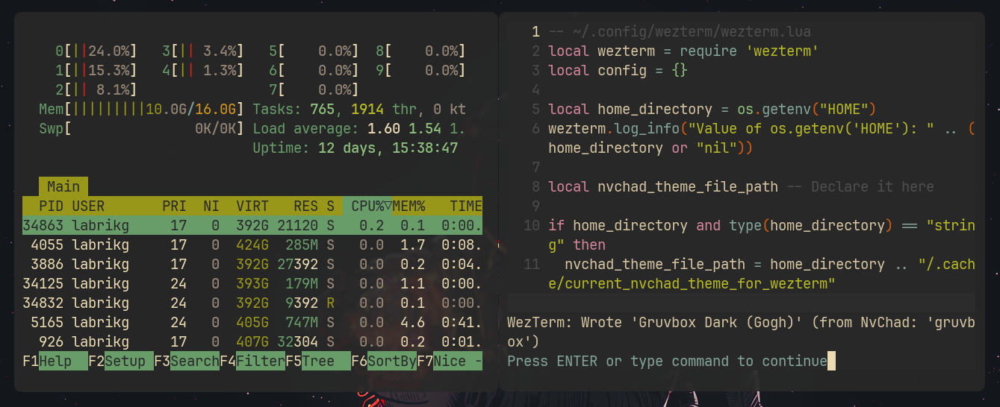

# NvChad-WezTerm Theme Sync

Automatically synchronize WezTerm terminal theme with your active NvChad (Neovim) theme.

## How It Works

The synchronization is achieved through a straightforward process:

1.  **NvChad Detects Theme Changes:** A custom Lua script within your NvChad configuration listens for the `ColorScheme` event.
2.  **Theme Name Shared:** When you change themes in NvChad, this script writes the name of the current NvChad theme to a temporary file (e.g., `~/.cache/current_nvchad_theme_for_wezterm`).
3.  **WezTerm Applies the Theme:** Your `wezterm.lua` configuration is set up to read this file when WezTerm starts.

## Key Requirement: Matching Theme Names

**Important:** For this particular theme synchronization setup to function correctly, the **theme names used in NvChad must exactly match the names of available color schemes in the WezTerm installation.**

**The setup works for macOS. It should also work for Linux. If not, check the temporary cache file/path and change it accordingly.**

Right now not all themes are supported. See `theme_map` in `wezterm_theme_sync.lua` for the supported themes.

You can link a theme in NvChad with a theme in Wezterm by adding: `["NvChadThemeName"] = "WezTermThemeName"` in `local theme_map` in `wezterm_theme_sync.lua`. I couldn't be bothered to add other themes that I don't use.

Gruvbox example:

# Setup Overview

1.  **NvChad Configuration:**
    * Place the NvChad Lua script (`wezterm_theme_sync.lua`) into your NvChad custom Lua directory (typically `~/.config/nvim/lua/custom/`).
    * Ensure this script is loaded by your NvChad setup. For example, add `require("custom.wezterm_theme_sync")` to your `~/.config/nvim/lua/custom/init.lua` (or `chadrc.lua` if appropriate for your NvChad version's structure).

2.  **WezTerm Configuration:**
    * Merge the provided WezTerm Lua configuration into your `~/.config/wezterm/wezterm.lua` file.
    * Double-check that the path to the temporary theme file (e.g., `~/.cache/current_nvchad_theme_for_wezterm`) is identical in both the NvChad script and your `wezterm.lua`.

4.  **Restart:**
    * Restart Neovim first and WezTerm after to apply the new configurations.

# Troubleshooting

**Can't Switch NvChad Themes? Seeing "module 'chadrc' not found"?**

If Neovim starts up fine and your initial theme syncs to WezTerm, but you see an error like module 'chadrc' not found (often mentioning a file like nvchad/themes/mappings.lua) specifically when you try to change your theme within NvChad, here's a fix:

1. Open your terminal
2. Go to your Neovim Lua directory: `cd ~/.config/nvim/lua`    
3. Create a link: `ln -s ./custom/chadrc.lua ./chadrc.lua`
5. Restart Neovim and try switching themes. The error should now be gone!
